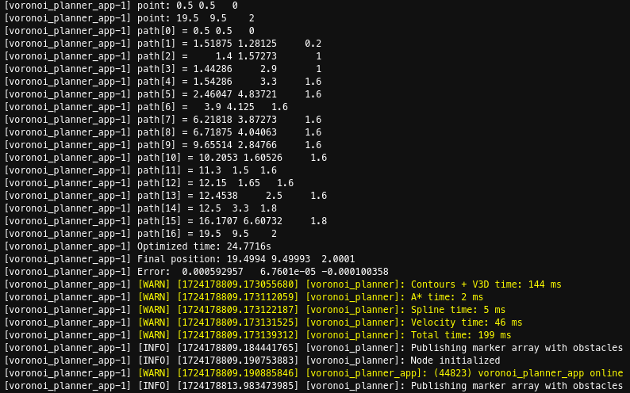
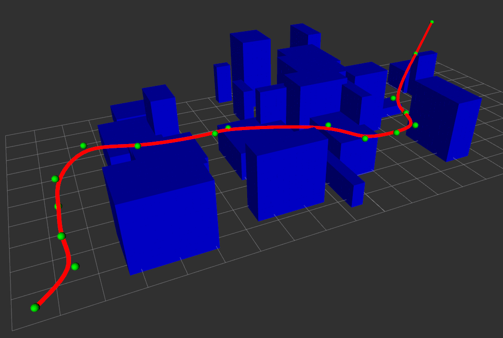

# VoronoiPlanner3D

**VoronoiPlanner3D** is a ROS 2 package for 3D planning using the Generalized Voronoi algorithm.

This work starts as a translation into C++ of the planning algorithm written in Python and described in:

    “An Efficient Framework for Autonomous UAV Missions in Partially-Unknown GNSS-Denied Environments”,
    Mugnai, Teppati Losé, Herrera-Alarcòn, Baris, Satler, Avizzano,
    Published in Drones 18 July 2023.
    
Such algorithm uses [generalized_voronoi_diagram](https://github.com/ross1573/generalized_voronoi_diagram) by [ross1573](https://github.com/ross1573) and [toppra](https://github.com/hungpham2511/toppra) by [hungpham2511](https://github.com/hungpham2511) and it works as follows:

- **[GVD]** creates a 2D Voronoi diagram of a planar scene and its corresponding graph;
- **[GVD]** finds the best path using the A* algorithm;
- **[TOPPRA]** computes the time-optimal path parametrization for robots subject to kinematic and dynamic constraints.

**VoronoiPlanner3D** focuses on improving the first two steps identified with **[GVD]** by using C++, achieving a **speed improvement up to 30x**.
Additionally, a simple yet effective 3D implementation is obtained by dividing the space into different horizontal slices, computing the GVD for each of them, and constructing the 3D graph by stacking the 2D slices and connecting closer nodes across layers. Although The 3D implementation is not perfect, it is extremely fast and can be used in scenarios where continuous recomputations are required.

Finally, the computed 3D path is processed using TOPPRA's C++ library to obtain the desired parametrization.

The code was written and tested using ROS 2 Humble Hawksbill on Ubuntu 22.04.4 LTS (Jammy Jellyfish). While it may work natively on other ROS 2 and Ubuntu distributions, it has not been tested outside this configuration.


## Installation

### 1. Install Third-Party Libraries

**VoronoiPlanner3D** needs some libraries to compile:
- [toppra](https://github.com/hungpham2511/toppra);
- [matplotlib-cpp](https://github.com/lava/matplotlib-cpp);
- [qhull](https://github.com/qhull/qhull).

To build these libraries from source (recommended), you may follow these general steps: 

```bash
git clone <repo_url>
cd <repo_name>
mkdir build
cd build
cmake ..
make
sudo make install
```

**Note**: when building TOPPRA, use the following command after cloning the repository:

```bash
cd <repo_name>/cpp
```

### 2. Clone VoronoiPlanner3D and compile

```bash
git clone https://github.com/lorenzo-bianchi/VoronoiPlanner3D
cd VoronoiPlanner3D
colcon build --symlink-install --packages-select voronoi_planner
```

Then, source the local_setup file with

```bash
. install/local_setup.zsh
```

or

```bash
. install/local_setup.bash
```

depending on the shell you are currently using.

### 3. Launch VoronoiPlanner3D node

```bash
ros2 launch voronoi_planner voronoi_planner.launch.py
```

After launching, you should see the output showing the path from the starting to the ending point, the optimized time computed by TOPPRA, the final position and the error obtained, as final check, by simulating a point moving from starting position under optimal velocities.



The execution times for individual steps of the code are displayed in yellow.

Moreover, the code publishes a `MarkerArray` message representing obstacles and the optimal trajectory, which can be visualized in RViz. 



The code is meant to run the algorithm once and then keep publishing the `MarkerArray` until the user stops the execution by pressing `CTRL+C`. This is intendend just as an example of how the code works: users will need to implement their own callbacks to receive the different map layers and use the functionalities of this library to compute the final trajectory.

## TODO
- Add docker

## License
This work is licensed under the GNU General Public License v3.0. See the LICENSE file for details.

## Disclaimer

This software has been tested, but it may still contain bugs or issues. Use it at your own risk. The author(s) of this project are not responsible for any damage, loss, or other consequences resulting from the use of this software. We recommend thoroughly testing the software in your environment before using it in production.

If you encounter any bugs or issues, please report them by opening an issue on the [GitHub repository](https://github.com/lorenzo-bianchi/VoronoiPlanner3D).
